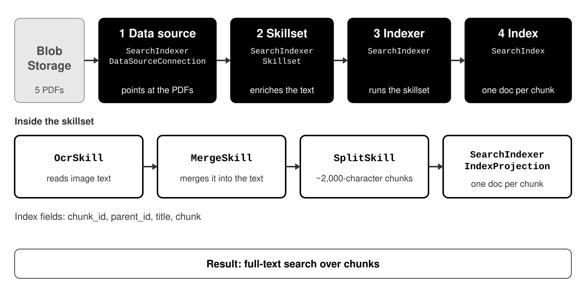
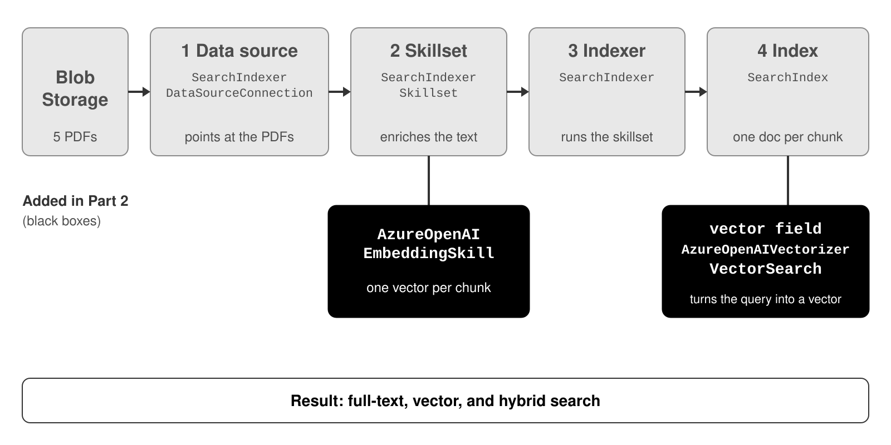
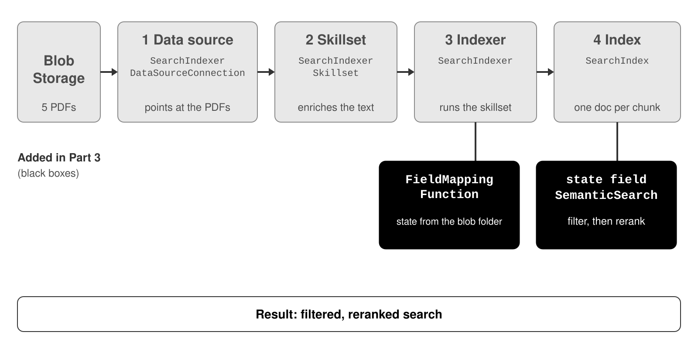

# Module 2: Indexing pipeline

Build an Azure AI Search index for the five driver's manuals, in three parts. Each part adds one goal. Black boxes are what the part adds.

| File | What it is |
|---|---|
| `README.md` | This page: one diagram per part. |
| `helpers.py` | Pre-built functions. Each one wraps one Azure class. |
| `02_indexing_pipeline.ipynb` | The notebook. Fill in each `____` to build the part. |

## Part 1: Turn the PDFs into searchable chunks

| Box | Azure class | What it does |
|---|---|---|
| 1 Data source | `SearchIndexerDataSourceConnection` | Points the indexer at the PDF container in Blob Storage. |
| 2 Skillset | `SearchIndexerSkillset` | Holds the enrichment steps and the index projection. |
| Skillset step | `OcrSkill` | Reads text from the images in the PDFs. |
| Skillset step | `MergeSkill` | Puts the OCR text back into the page text. |
| Skillset step | `SplitSkill` | Cuts the text into chunks of about 2,000 characters, with 500 characters of overlap. |
| Skillset step | `SearchIndexerIndexProjection` | Makes each chunk its own search document. |
| 3 Indexer | `SearchIndexer` | Runs the skillset and fills the index. It maps `title` from the blob name. |
| 4 Index | `SearchIndex` | Stores one search document for each chunk: `chunk_id`, `parent_id`, `title`, `chunk`. |

## Part 2: Match by meaning, not just words

| Box | Azure class | What it does |
|---|---|---|
| Skillset step | `AzureOpenAIEmbeddingSkill` | Creates one vector for each chunk. |
| Index vectors | `VectorSearch` | Stores the `vector` field and how to search it. |
| Index vectors | `AzureOpenAIVectorizer` | Turns the query text into a vector at search time. |

## Part 3: Filter by state and rank by relevance

| Box | Azure class | What it does |
|---|---|---|
| Indexer mapping | `FieldMappingFunction` | Takes `state` from the blob folder name. |
| Index ranking | `SemanticSearch` | Adds the semantic ranker. The `state` field adds the filter. |
