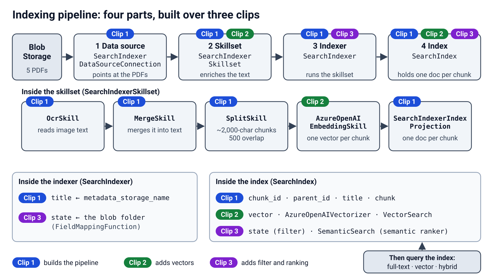
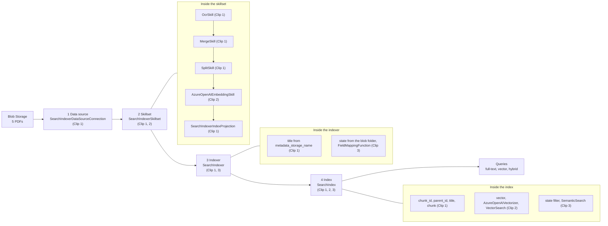

# Indexing pipeline

Four parts turn the five driver's-manual PDFs into a searchable index. Each clip adds to the same pipeline.

## Azure classes

| Box | Azure class | What it does | Clip |
|---|---|---|---|
| 1 Data source | `SearchIndexerDataSourceConnection` | Points the indexer at the PDF container in Blob Storage. | 1 |
| 2 Skillset | `SearchIndexerSkillset` | Holds the enrichment steps and the index projection. | 1 |
| Skillset step | `OcrSkill` | Reads text from the images in the PDFs. | 1 |
| Skillset step | `MergeSkill` | Puts the OCR text back into the page text. | 1 |
| Skillset step | `SplitSkill` | Cuts the text into chunks of about 2,000 characters, with 500 characters of overlap. | 1 |
| Skillset step | `SearchIndexerIndexProjection` | Makes each chunk its own search document. | 1 |
| Skillset step | `AzureOpenAIEmbeddingSkill` | Creates one vector for each chunk. | 2 |
| 3 Indexer | `SearchIndexer` | Runs the skillset and fills the index. It maps `title` from the blob name. | 1 |
| Indexer mapping | `FieldMappingFunction` | Takes `state` from the blob folder name. | 3 |
| 4 Index | `SearchIndex` | Stores one search document for each chunk: `chunk_id`, `parent_id`, `title`, `chunk`. | 1 |
| Index vectors | `VectorSearch` | Stores the `vector` field and how to search it. | 2 |
| Index vectors | `AzureOpenAIVectorizer` | Turns the query text into a vector at search time. | 2 |
| Index ranking | `SemanticSearch` | Adds the semantic ranker. The `state` field adds the filter. | 3 |

## Mermaid version

